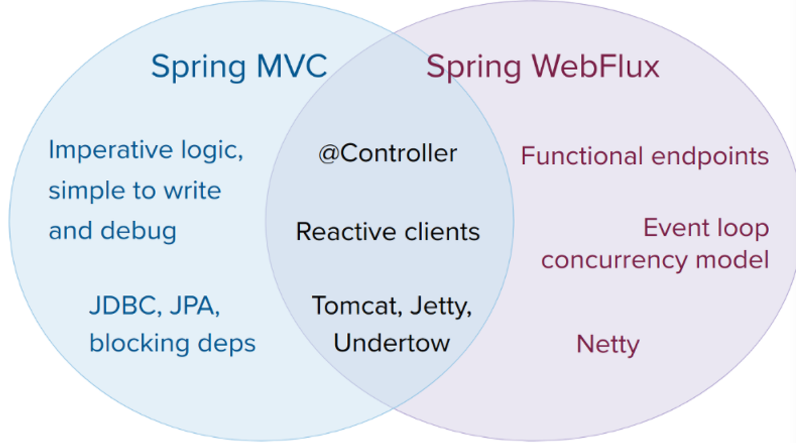

# WebFlux
WebFlux
Reactive
non-blocking & functional

# 事件驱动
I/O Event => Network Components
mouse Event => UI Controller
operations complete =>
data becomes available => 

# imperative code 命令式 
forces the caller to wait

# non-blocking code
important to control the rate of events 控制事件发生率

# Spring 官方举例
For example 
a data repository (acting as Publisher) can produce data that an HTTP server (acting as Subscriber) can then write to the response. 
The main purpose of Reactive Streams is to let the subscriber control how quickly or how slowly the publisher produces data.
假设有一个数仓可以提供数据，然后 HTTP Server（订阅者） 将提供的数据写到 Response 中。
那么，反应流的主要目的是让订阅者控制发布者产生数据的速度（即上文提到的控制事件发生率）。

# 假如 Publisher 无法慢下来呢
The purpose of Reactive Streams is only to establish the mechanism and a boundary. 
If a publisher cannot slow down, it has to decide whether to buffer, drop, or fail.
决定是否缓冲、 丢弃、 或失败。

# Reactive Stream
interest to libraries and infrastructure components
less useful as an application API
反应流在其中扮演重要的角色，但其对库以及基础设施组件感兴趣，但并不适合作为应用 API，因为过于底层。 low-level

# Reactor
Spring WebFlux choice Reactor as Reactive library
it provides :
Mono API 单声道系统（困惑中。。。）
Flux API 流
working on data sequence
all of its operators support non-blocking back pressure.

# WebFlux
core dependency : Reactor
but it is interoperable with other reactive libraries via Reactive Streams. （eg. RxJava）

WebHandlerApi => Servlet Api
Spring Web Module contains the reactive foundation that underlies Spring WebFlux.

On that foundation, Spring WebFlux provides a choice of two programming models:
1. Annotated Controllers
2. Functional Endpoints
The big difference with annotated controllers is that the application is in charge of 
request handling from start to finish versus declaring intent through annotations and being called back.

Reactive and non-blocking generally do not make applications run faster.
The key expected benefit of reactive and non-blocking is the ability to scale with a small, 
fixed number of threads and less memory. 

Both Spring MVC and Spring WebFlux support annotated controllers
1. Spring MVC : It is assumed that applications can block the current thread, (for example, for remote calls). 
 => a large Thread-pool
2. Spring WebFlux : It is assumed that applications do not block. => a small Thread-pool
